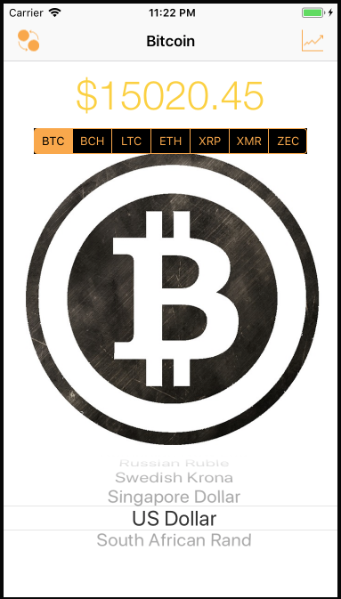
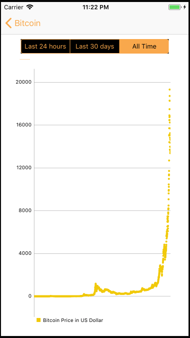
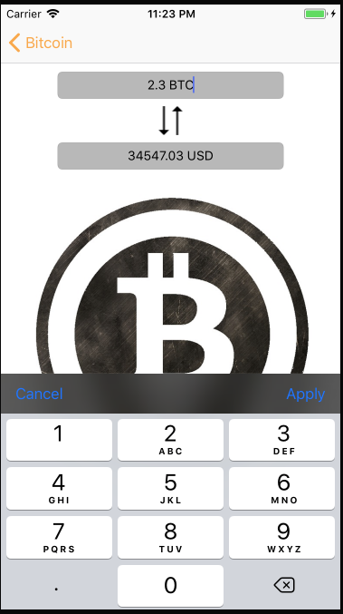

# cryptoPrice

This iOS app displays real-time price data of 7 cryptocurriencies across 21 different fiat currencies.  It also charts historical price for the last 24 hours, last 30 days and for all time.  Lastly, it allows user to convert between cryptocurrency price and fiat currency price for any of the 7 cryptocurriencies in any of the 21 different fiat currencies.

This was built in Swift and uses the Alamofire library to fetch crypto price information from a cryptocurrency API, the SwiftyJSON library to parse the response and the iOS Charts library to chart historical prices.

This app is pending being added to the Apple AppStore.

